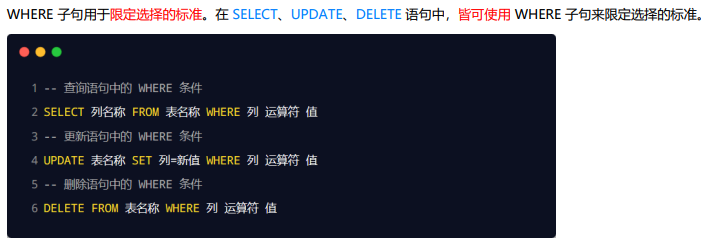

## Node.js学习记录

### 参考资料 
https://www.bilibili.com/video/BV1a34y167AZ?p=9&spm_id_from=pageDriver&vd_source=88e4bffc33a1ac3ec57e1b3c0320c0bf

### 学习记录（持续更新）

#### 2022.09.05
- nodejs如何运行js文件
- fs文件系统模块
  - 读文件fs.readFiles
  - 写文件fs.writeFiles
- path路径模块
  - 拼接path.join
  - 文件名path.basename
  - 拓展名path.ext

#### 2022.09.06 / 07
- http模块：创建web服务器
  - 引入模块
  - 创建server实例
  - 绑定request事件：发送请求时触发
    - req：请求对象 url表示从端口号开始的url地址；method表示请求方式
    - res：响应对象 .end(str)返回指定内容，并结束处理过程
  - 绑定拎树藤事件：启动服务器成功后返回
- 模块化
  - 模块作用域
  - 向外共享：module.exports对象
  - exports和module.exports指向同一对象，但引入模块时调的是后者

#### 2022.09.08
- npm与包
  - npm install module_name
  - npn init -y 生成 package.json
  - npm install 会一次性安装 package.json 中的 dependencies 安装包
  - 如果某些包旨在项目开发时有用，上线时不用，加入devDependencies中，
    - npm i 包名 -D
    - npm install 包名 --save-dev
  - 切换镜像
    - npm config get registry 查看当前镜像
    - npm config get registry=""切换镜像地址
  - 采用nrm工具切换镜像
    - 安装：npn i nrm -g（表示全局包）
    - 查看源列表：nrm ls
    - 切换源：nrm use taobao
  - 一般只有工具包才会当作全局包，如i5ting_toc，将md文件转化为html文件
  - 发布npm包：npm publish

#### 2022.09.09
- 模块的加载机制
  - 模块在第一次加载之后会被缓存，优先从缓存中加载
  - 内置模块加载优先级最高
  - 自定义模块需要加上./或../，加载顺序如下：
    - 按照确切的文件名加载
    - 补全.js
    - 补全.json
    - 补全.node
    - 加载失败
  - 第三方模块加载机制
    - 一层一层网上找\node_modules\tools
  - 目录作为模块
    - 目录下查找package.json，main属性指向的文件为require函数的入口
    - 没有package.json或main入口，加载目录下的index.js文件
- Express库
  - 创建
    - 加载express库
    - 实例化服务器
    - 启动app.listen(80, ()=>{})
  - 请求
    - app.get(URL, (req,res)=>{})
    - app.post(URL, (req, res) => {})
    - res.send(内容)响应
    - req.query获取get中URL带有的查询字符串，返回对象
    - req.params获取URL/:id/:name的动态参数，返回对象
  - express对外提供静态资源
    - app.use(express.static('文件目录'))，提供文件目录下的所有文件，默认隐藏文件目录的路径
    - app.use('/abc', express.static('文件目录'))，加路径前缀
- 路由
  - 定义：客户端请求与服务器请求之间的映射关系，
    - 只有请求类型和和请求的URL同时匹配成功才会处理
    - 从上到下匹配
  - 使用
    - app.get/post/use
    - 模块化
      - 创建对应的js文件
      - const router = express.Router();
      - router.get/post
      - module.exports = router
      - 在服务器全局注册中间件app.use(router)
    - 路由模块添加前缀，app.use('/abc', router)
- 中间件
  - 全局生效定义：app.use(function(req, res, next){ next(); });
  - 局部生效定义：app.get('/', mw1, mw2, (req, res) => {})
  - 注意事项：
    - 多个中间件之间共享一份req和res
    - app.use()定义多个中间件，按照顺序依次调用
    - 一般情况下，要在路由前注册中间件
    - 不要忘了写next()，且next()后不要写代码
  - 中间件分类
    - 应用级别中间件
    - 路由级别中间件
    - 错误级别中间件：捕获整个项目的异常错误
      - app.use((err, req, res, next) => {})
    - 内置中间件
      - 静态资源：express.static
      - 解析JSON格式的POST请求：app.use(express.json())
      - 解析URL-encoded格式的POST请求：app.use(express.urlencoded({extended:false}))
      - req.body属性是请求体对象
    - 第三方中间件：body-parser
      - const parser = require('body-parser)
      - app.use(parser.urlencoded({extended:false}))
- 跨域解决方案CORS
 
  - 使用：const cors = require('cors'); app.use(cors())
  - CORS响应头部
     
     
     
  - CORS请求分类
     
     
  - JSONP与CORS同时使用注意事项
     
     

#### 2022.09.10
- 数据库-数据表-数据行-字段
- [MySQL安装](./20220910/%E5%AE%89%E8%A3%85%E6%95%99%E7%A8%8B%20-%20Windows%E7%B3%BB%E7%BB%9F%E5%AE%89%E8%A3%85MySql/README.md)
- SQL语句
   
   
   
   
   
  - and/or表示与/或
   
  - count(*)表示查询总数
  - as设置别名
- 项目中使用数据库
  - 安装mysql库
  - 配置mysql库
  - 增删改查
    
   
   
   
   
   
   
   
   

#### 2022.09.11
- Session身份认证机制:用于服务端渲染
  - 将信息存储到Cookie中，不具有安全性，不能存储重要数据
  - 工作原理
   
  - 使用
    - 安装express-session库
    - 导入
    - 注册中间件:app.use(session({secret:'', resave:false, saveUninitialized:true}))
    - 向session中存取数据:注册中间件后会有req.session对象，用来存储信息
    - 清空：req.session.destory()
- JWT认证机制：JSON Web Token
  - 工作原理
   
  - 组成部分：header.**payload**.signature
  - 将JWT字符串放在HTTP请求头中的Authorization字段中，格式：`Authorization: Bearer <token>`
  - 使用JWT
    - 安装jsonwebtoken包,jwt = require('jsonwebtoken');
    - 定义secret密钥
    - 生成jwt字符串`res.send({status:200,message:'登陆成功',token:jwt.sign(obj, secretKey, {expireIn:'time'})})`
    - jwt字符串还原为json对象：在app.js中，路由前，注册app.use(expressJWT({ secret: config.secretKey, algorithms: ['HS256'] }).unless({ path: /^\/api\// }))
    - 注册后使用req.auth获取用户信息（obj）
    - 捕获解析jwt失败的错误：if (err.name === 'UnauthorizedError') return res.cc("身份验证失败");

#### 2022.09.11_项目
- 实现思路见[参考文档](20220911_Project/ev_api_server.md)
- bcryptjs加密
  - 安装、导入
  - 加密：userInfo.password = bcryptjs.hashSync(userInfo.password, 10);
  - 验证/比较：
    - const compareResult = bcryptjs.compareSync(userInfo.password, results[0].password);
    - if (!compareResult) return res.cc("密码输入错误！");
- 表单数据验证：使用第三方库joi
- 2022.09.11实现了登录注册的功能

#### 2022.09.12_项目
- 实现了用户信息获取、修改、重置密码、更新头像的功能